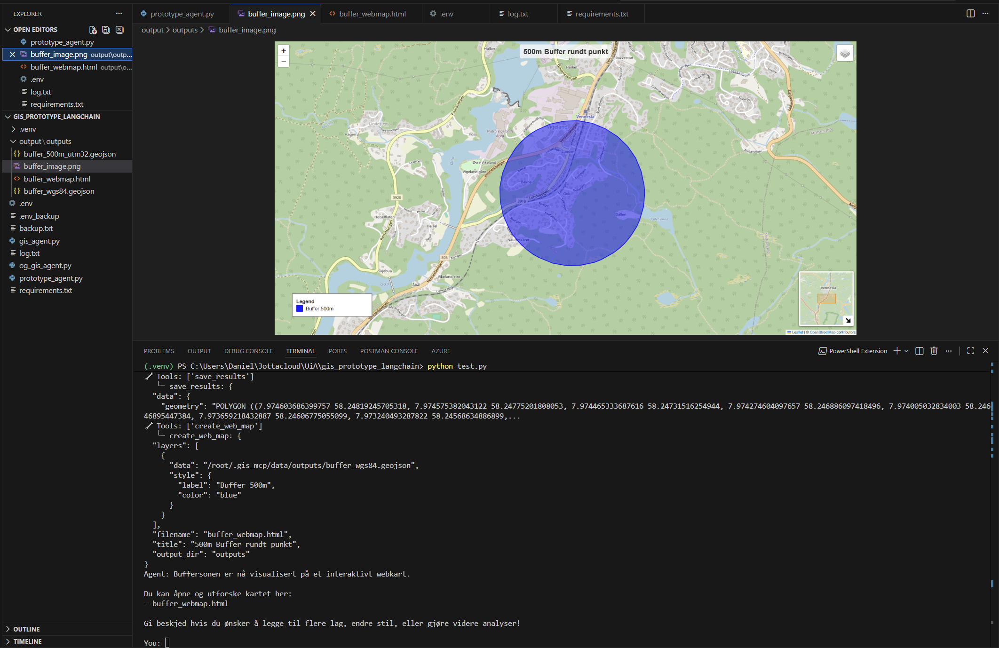
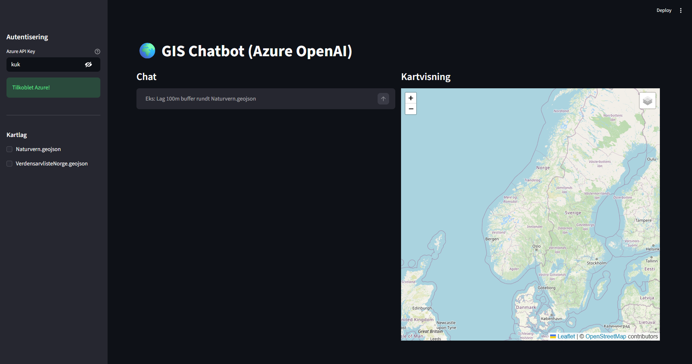
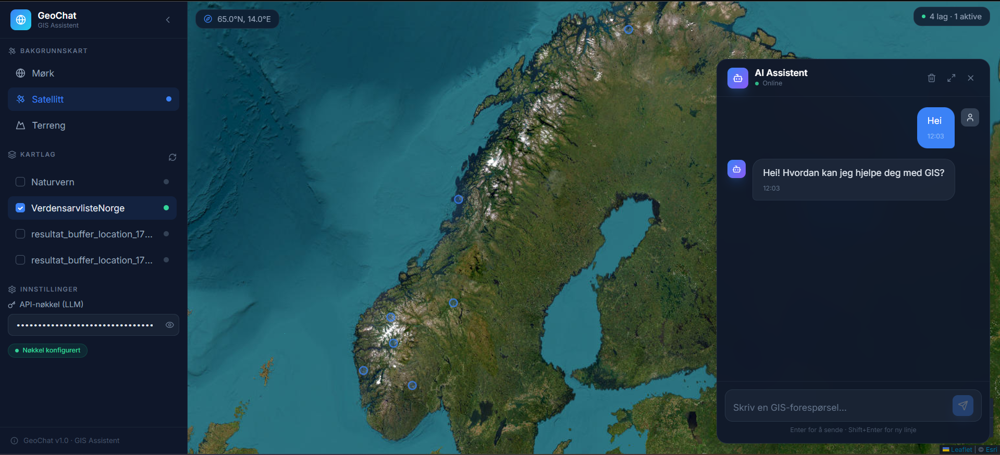
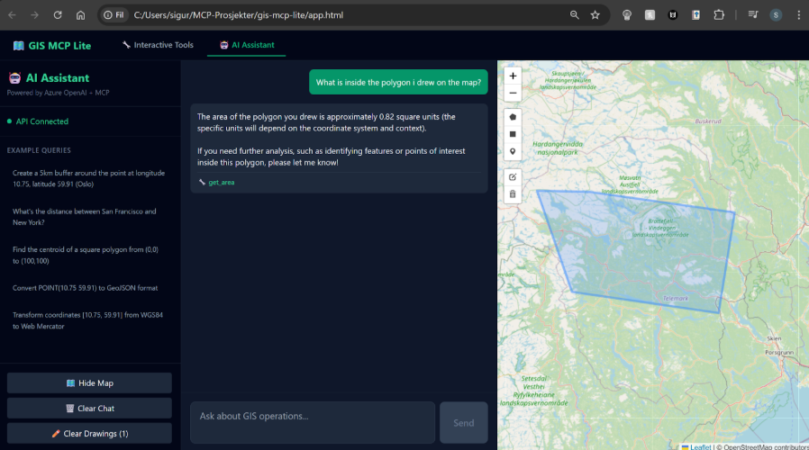
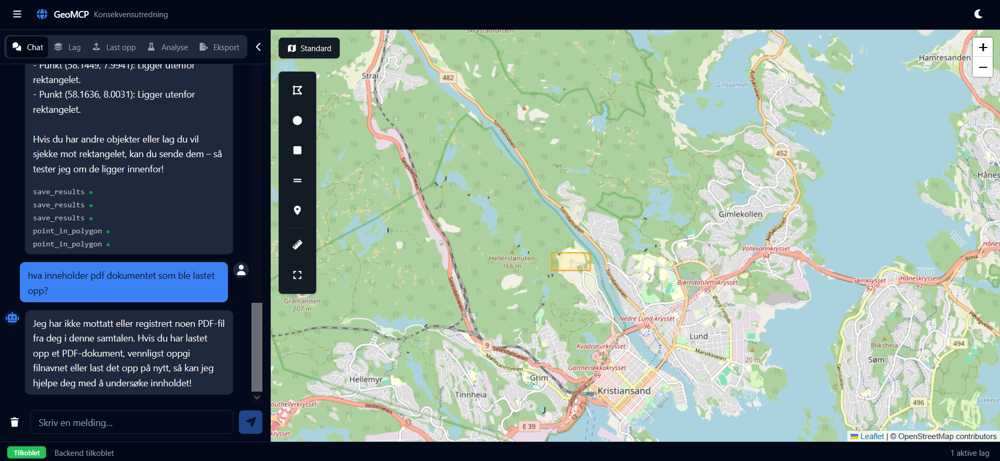
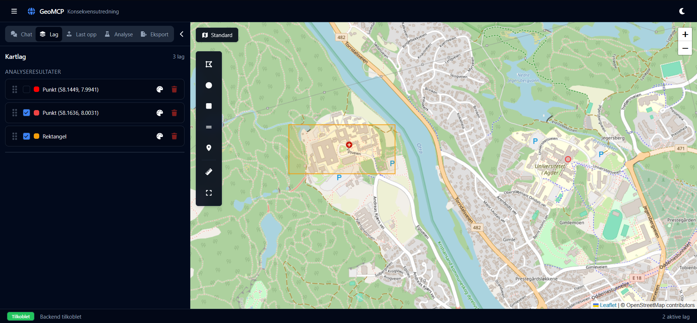
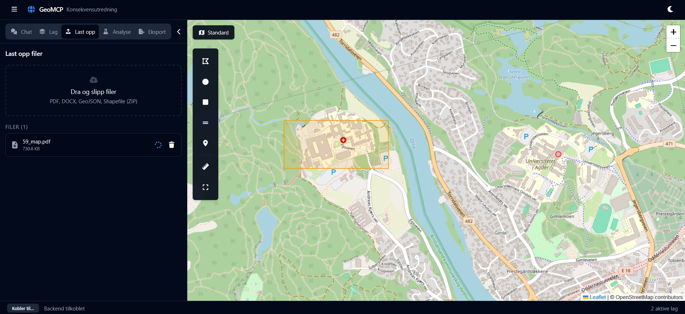
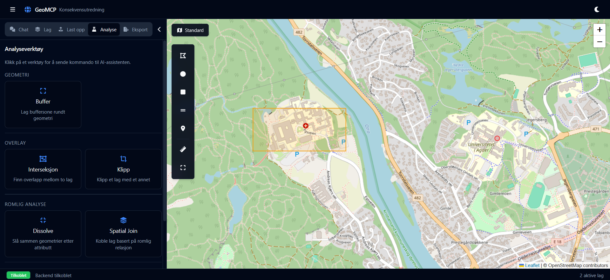
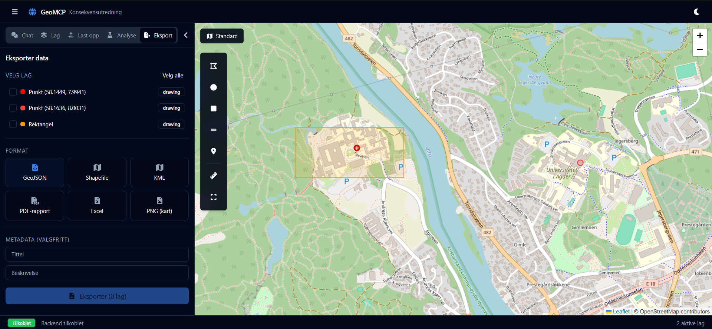
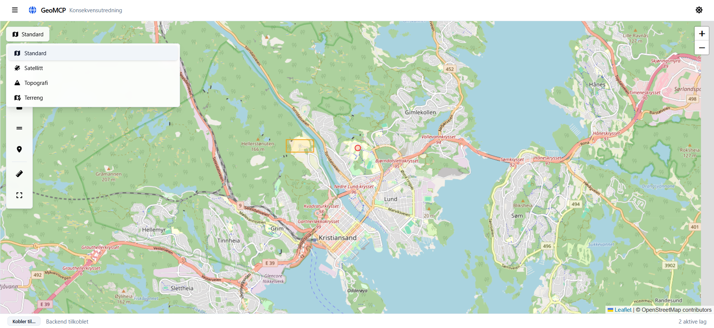

  
  
<em>AI-assistert geospatialt arbeidsverktøy for kartanalyse og KU-relaterte arbeidsflyter</em>

---
## Oversikt

Atlas er en GeoMCP-chatbot utviklet for å assistere saksbehandlere i arbeid med norske konsekvensutredninger (KU). Assistenten kombinerer et interaktivt kart, dokumentbasert kontekst og romlige analyser i ett grensesnitt – og lar brukere stille faglige spørsmål, hente geodata og eksportere kartlag uten å forlate arbeidsflaten.

---

## Personlige Brukere

### Registrering

Nye brukere kan registrere seg gjennom logg inn-knappen.

### Innlogging 

Eksisterende brukere logger inn gjennom samme knapp. 

---

## Chat

### Send Melding

 

Skriv enkelt spørsmål eller forespørsler, og få svar fra assistenten.

---

### Samtalehistorikk

Alle tidligere samtaler vises i sidepanelet. Klikk på en samtale for å åpne den igjen og fortsette der du slapp.

---

### Slette en samtale

Samtaler kan slettes enkeltvis fra historikkpanelet.

---

### Tokenforbruk

Brukere kan se tokenforbruk per melding direkte i chatten.

---

## Kart

### Kartvisninger 

Kartarbeidsområdet er sentrert på Norge med bakgrunnskart fra Kartverket og flyfoto fra Esri.
Brukere kan bytte mellom bakgrunnskart i sanntid.

---

### Tegning i kart

Leaflet gir tilgang til tegning av markører, polygoner, rektangler, linjer og sirkler,
samt redigering og fjerning av eksisterende lag. Posisjonering bruker nettleserens Geolocation API.

### Laghåndtering

Hvert kartlag kan skjules, vises på nytt eller slettes fra sidepanelet.
AI-genererte lag og brukerens egne lag behandles likt.

---

## Verktøy i aksjon

**1 — Velg og send verktøy**

**2 — Resultat fra assistenten**

---

## Eksport

Valgte lag kan eksporteres direkte fra nettleseren:

- **GeoJSON** — råformat for videre databehandling
- **JSON** — generisk format
- **PNG** — kartskisse som bilde
- **PDF** — kartskisse klar for rapport

---

## Mørk og lys modus

Atlas støtter mørk og lys modus og husker innstillingen i nettleseren.

---

## Demonstrasjonsvideo

  

    <iframe
      src="https://www.youtube.com/embed/pPJkSxmbnVA"
      title="Atlas demonstrasjonsvideo"
      frameborder="0"
      allow="accelerometer; autoplay; clipboard-write; encrypted-media; gyroscope; picture-in-picture"
      allowfullscreen>
    </iframe>
  

---

## Fra prototype til Atlas

<em>Utviklingsprosessen og tidlige prototyper</em>

### Prototype 1 — Første konsept

  

  <em>Første fungerende prototype med bufferhåndtering og kart-output.</em>

---

### Prototype 2 — UI-konsept

  

  <em>Første frontend-konsept med fokus på layout og brukeropplevelse.</em>

---

### Prototype 3 — UI iterasjon

  

  <em>Videreutvikling av panelsystem, navigasjon og visuell struktur.</em>

---

### Prototype 4 — Designforfining

  

  <em>Videre modning av interaksjonsdesign og arbeidsflyt.</em>

---

### Prototype 5 — Funksjonell arbeidsflyt

<em>En interaktiv prototype som demonstrerer kartarbeid og analyse i praksis.</em>

  
  
  
  
  
  

---

  <a href="#top">Tilbake til Topp</a>
  <a href="#personlige-brukere">Brukere</a>
  <a href="#chat">Chat</a>
  <a href="#kart">Kart</a>
  <a href="#verktoy">Verktøy</a>
  <a href="#eksport">Eksport</a>
  <a href="#modus">Modus</a>
  <a href="#video">Video</a>
  <a href="#prototype">Prototype</a>

<button id="hamburger-btn" aria-label="Åpne navigasjon">
  
  
  
</button>

  <a href="#top">Tilbake til topp</a>
  <a href="#personlige-brukere">Brukere</a>
  <a href="#chat">Chat</a>
  <a href="#kart">Kart</a>
  <a href="#verktoy">Verktøy</a>
  <a href="#eksport">Eksport</a>
  <a href="#modus">Modus</a>
  <a href="#video">Video</a>
  <a href="#prototype">Prototype</a>

<link rel="stylesheet" href="https://cdnjs.cloudflare.com/ajax/libs/font-awesome/6.5.0/css/all.min.css">

  <a class="floating-btn" id="github-link" href="https://github.com/KartAI/Atlas" target="_blank" aria-label="GitHub">
   <i class="fa-brands fa-github"></i>
  </a>
  <button class="floating-btn" id="theme-toggle">
   <i id="theme-icon" class="fa-solid fa-moon"></i>
  </button>

